<!-- 🏁 Custom Banner -->

  

<h1 align="center">Hi 👋, I'm Aman Kumar Gupta</h1>
<h3 align="center">Full Stack Developer &middot; Agentic AI &amp; LLM Systems &middot; B.Tech CSE @ IIIT Bhagalpur</h3>

  <a href="https://www.linkedin.com/in/aman-kumar-gupta-b0281b302">LinkedIn</a> ·
  <a href="https://github.com/guptaaman9170">GitHub</a> ·
  <a href="mailto:guptaaman9170@gmail.com">Personal Email</a>

<table>
<tr>
<td width="370" valign="top">
  
</td>
<td width="490" valign="top">
  
</td>
</tr>
</table>

  

Contribution graph refreshes daily via GitHub Actions — no token, no auth.

---

## 🚀 About Me

- 🎓 Pursuing **B.Tech in Computer Science and Engineering** at **Indian Institute of Information Technology, Bhagalpur** (CGPA: **8.49 / 10** | Aug 2023 – Expected Jul 2027).
- 🤖 **Full Stack Developer** specializing in building agentic AI, LLM-integrated REST backends, and real-time distributed microservices in JavaScript and Python.
- 🛠️ Shipped a **7-node LangGraph agent** and a **3-service real-time messaging platform**, and solved **1000+ Data Structures & Algorithms problems**.
- 💼 Former **Full Stack Web Developer Intern** at **AI Ally** (Hybrid, Nashik) — engineered a QR food ordering platform, multilingual OpenAI voice ordering, and event-driven Power Automate pipelines.
- 🏆 **National Finalist** at **Idea One Hackathon 2025** (2nd in East Region, Top 1% of 1000+ teams) & **5th Rank Nationwide** at **Jaipur Cybrathon 2K25**.
- 🧩 **Competitive Programmer**: **Codeforces Pupil** (1213 rating) and **CodeChef 3-Star** (1625 rating) with 1000+ DSA problems solved across LeetCode, Codeforces, and CodeChef.
- 📧 Reach me at: **guptaaman9170@gmail.com** | Sitapur, Uttar Pradesh, India

---

## 💼 Work Experience

**Full Stack Web Developer Intern (Hybrid, Nashik)** — AI Ally  
Jun 2025 – Oct 2025
- Developed a QR-based food ordering platform in **React.js, Node.js, Express.js, and MongoDB**, replacing physical printed menus with a 1 scan-to-order flow served by **10+ REST endpoints**.
- Integrated **OpenAI APIs and generative AI** for multilingual voice ordering, collapsing a multi-step food selection form into 1 spoken natural language request for guests with limited literacy or mobility.
- Automated fulfillment workflows with **Microsoft Power Automate**, cutting repetitive operator handoffs down to 1 event-driven trigger per confirmed order.
- Streamlined service integrations behind centralized validation and exception handling, eliminating inconsistent error responses across 2 deployment environments.

---

## 🚀 Featured Projects

### 🍽️ 1. **[DineScout AI — Agentic Restaurant Recommendation System](https://github.com/guptaaman9170/Restaurant-AI-agent)**
`React.js` · `Node.js` · `Express.js` · `LangGraph.js` · `LangChain` · `Google Gemini` · `Tavily Search API` · `Zod` · `MongoDB Atlas`
- Engineered an asynchronous **7-node LangGraph.js agentic workflow** over 15 typed state channels, replacing ad-hoc prompt chaining with an auditable graph spanning intent analysis, discovery, research, and synthesis.
- Validated every Google Gemini response against **Zod JSON schemas across 5 reasoning stages**, collapsing 5 disparate parsers into 1 unified schema layer and eliminating malformed LLM outputs.
- Designed a **deterministic 6-factor weighted ranking engine** (budget 25%, dietary 25%, cuisine 20%, atmosphere 15%, dish 10%, evidence 5%), delivering 100% reproducible rankings grounded in real evidence.
- Optimized perceived latency by streaming **7 real-time progress checkpoints over Server-Sent Events (SSE)** instead of 1 terminal response, grounding recommendations on 3 Tavily web retrieval pipelines.

---

### 🎙️ 2. **[Lenny Growth Assistant — RAG-Powered Podcast Intelligence System](https://github.com/guptaaman9170/lenny-growth-assistant)**
`FastAPI` · `Python` · `React.js` · `PostgreSQL` · `SQLAlchemy` · `ChromaDB` · `Ollama (Qwen2.5)` · `RAG` · `Tailwind CSS`
- Built an AI-powered conversational search and growth intelligence system for querying and synthesizing tactical product advice across Lenny's Podcast transcripts.
- Implemented high-density semantic vector search with **ChromaDB embeddings** and local LLM inference using **Ollama (Qwen2.5:3B)** to deliver private, zero-latency answers with episode-level source citations.
- Architected persistent multi-turn chat sessions, context windows, and extracted knowledge artifacts using **PostgreSQL and SQLAlchemy**.
- Crafted an interactive, responsive frontend in **React.js and Tailwind CSS** with real-time markdown rendering, source attribution pills, and session management.

---

### 🛡️ 3. **[Borrower-Copilot — AI Lending Defense & Underwriting Rules Engine](https://github.com/guptaaman9170/Borrower-Copilot)** · [🌐 Live Demo](https://borrower-copilot-plum.vercel.app/)
`React.js` · `TypeScript` · `Vite` · `Tailwind CSS` · `Financial Rules Engine` · `FOIR / APR Modeling` · `Vercel`
- Architected a loan qualification and borrower defense copilot evaluating **FOIR thresholds, fair interest rate bands, RBI all-in APRs (including fees & GST)**, and safe EMI ceilings before loan agreement signing.
- Designed a **decoupled, zero-dependency pure TypeScript underwriting rules engine** (`src/rules/`) with preloaded benchmark personas (Salaried MNC, Kirana MSME, Informal Gig Worker).
- Built an interactive **Branch-Ready Negotiation Card** with mobile print-friendly styling, copyable verbatim negotiation scripts, red-flag audit checks, and income/rate stress test curves.
- Engineered adaptive 2-tier questioning with an honest confidence meter that widens ranges on missing data and appropriately models New-To-Credit (NTC) applicants.

---

### 🎯 4. **[InterviewPrep AI — Real-Time Generative AI Technical Mock Interviewer](https://github.com/guptaaman9170/InterviewPrep-AI)** · [🌐 Live Demo](https://interview-prep-ai-tau-seven.vercel.app/)
`React 19` · `Vite` · `Node.js` · `Express.js` · `MongoDB` · `Google Gemini API (@google/genai)` · `Framer Motion` · `Tailwind CSS`
- Engineered a full-stack technical interview preparation platform generating contextual interview questions and providing structured performance feedback using the **Google Gemini API (`@google/genai`)**.
- Built an end-to-end interview simulation runtime featuring dynamic question progression, role-specific technical evaluation, and detailed scorecards.
- Implemented secure JWT authentication with HTTP-only cookies, candidate progress persistence with **MongoDB**, and animated interactive interfaces with **Framer Motion**.
- Deployed on **Vercel** with full client-server decoupling, state management across interview stages, and responsive design.

---

### 💬 5. **[ConvoSync — Real-Time Microservices Chat Application](https://github.com/guptaaman9170/Wp-Clone)**
`React.js` · `Node.js` · `Express.js` · `Socket.IO` · `MongoDB` · `GridFS` · `Google OAuth 2.0` · `Docker` · `Docker Compose`
- Architected an enterprise-grade messaging platform as **3 containerized microservices**: an Express REST API, a Socket.IO real-time gateway, and a React browser client — reducing bootstrap to `docker compose up`.
- Implemented targeted WebSocket routing via an **in-memory user-to-socket registry**, reducing per-message emissions from global room broadcasts down to exactly 1 recipient session.
- Designed **3 Mongoose schemas across 9 REST routes** spanning 4 resource domains, deduplicating conversations with a members array-match query that eliminates duplicate threads on reopen.
- Delivered **Google OAuth 2.0 sign-in** with JWT credential decoding and **GridFS image streaming**, bypassing the 16 MB BSON inline document storage limit for seamless media uploads.

---

### 🏛️ 6. **[ResolveX V3.0 — AI Civic Grievance Redressal & Intelligent Decision Platform](https://github.com/guptaaman9170/ResolveX_V3.0)** · [🌐 Live Demo](https://resolve-x-v3-0.vercel.app/)
`React.js` · `Node.js` · `Express.js` · `Python` · `FastAPI` · `NLP & Scikit-learn` · `MongoDB` · `Vercel`
- Flagship intelligent civic platform earning **National Finalist status at Idea One Hackathon 2025** (2nd in East Region, Top 1% of 1000+ teams) & **5th Rank Nationwide at Jaipur Cybrathon 2K25**.
- Architected a distributed multi-tier ecosystem consisting of a citizen web portal, administrative command dashboard, Node.js/Express service, and a Python **FastAPI AI microservice**.
- Implemented automated **NLP text classification and priority triage algorithms** to categorize complaints, compute urgency scores, and eliminate manual routing bottlenecks.
- Delivered live real-time status tracking, department-level workload analytics, and cross-platform role-based dashboards.

---

## 🧰 Technical Arsenal

  

<b>Programming Languages</b>

  
  

<b>AI & Agentic Systems</b>

  
  
  
  
  
  
  
  
  
  

<b>Backend & Web Development</b>

  
  
  
  
  
  
  

<b>Databases & Storage</b>

  
  
  
  

<b>DevOps, Cloud & Tooling</b>

  
  
  
  
  

<b>Core Computer Science Concepts</b>

  
  
  
  
  
  
  

---

## 🏅 Achievements & Leadership

- 🧩 **Competitive Programming & DSA**: Solved **1000+ data structures and algorithms problems** across LeetCode, Codeforces, and CodeChef. Reached **Codeforces Pupil (1213 rating)** and **CodeChef 3-Star (1625 rating)**.
- 🥈 **2nd Rank in East Region & National Finalist @ Idea One Hackathon 2025**: Ranked inside the **top 1% of 1000+ competing teams** nationwide.
- 🏆 **5th Rank Nationwide @ Jaipur Cybrathon 2K25**: Advanced through 3 competitive elimination rounds to secure 5th position as a Grand Finalist against shortlisted national teams.
- 🤝 **Campus Mentorship (Adhyaay & EBSB Club)**: Coordinated 2 campus student bodies at IIIT Bhagalpur as mentor to junior students, organizing continuous engagement and skill-building programs from Jul 2024 onward.
- 🌟 **Event Lead | IGNITIA (Freshers 2K24)**: Directed logistics, operational workflows, and student volunteer teams for 1 incoming undergraduate batch in Jul 2024.

---

## 📜 Certifications

- 🏆 **[Front End Web and AI Developer](https://github.com/guptaaman9170)** — AI Ally *(Jun 2025 – Oct 2025)*